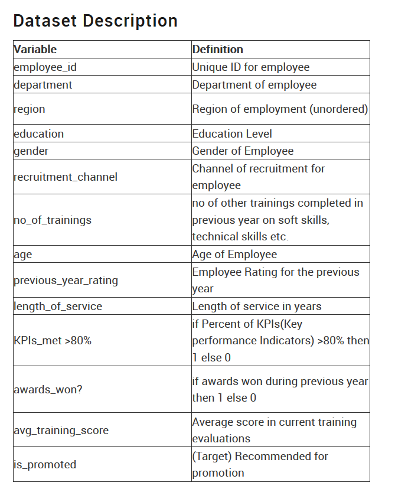

# HRanalytics

Link: [HRanalytics Analytics Vidhya](https://datahack.analyticsvidhya.com/contest/wns-analytics-hackathon-2018-1/)
## About Practice Problem: HR Analytics
HR analytics is revolutionising the way human resources departments operate, leading to higher efficiency and better results overall. Human resources has been using analytics for years. However, the collection, processing and analysis of data has been largely manual, and given the nature of human resources dynamics and HR KPIs, the approach has been constraining HR. Therefore, it is surprising that HR departments woke up to the utility of machine learning so late in the game. Here is an opportunity to try predictive analytics in identifying the employees most likely to get promoted.
## Problem Statement
Your client is a large MNC and they have 9 broad verticals across the organisation. One of the problem your client is facing is around identifying the right people for promotion (only for manager position and below) and prepare them in time. Currently the process, they are following is:
* 1: They first identify a set of employees based on recommendations/ past performance
* 2: Selected employees go through the separate training and evaluation program for each vertical. These programs are based on the required skill of each vertical
* 3: At the end of the program, based on various factors such as training performance, KPI completion (only employees with KPIs completed greater than 60% are considered) etc., employee gets promotion
For above mentioned process, the final promotions are only announced after the evaluation and this leads to delay in transition to their new roles. Hence, company needs your help in identifying the eligible candidates at a particular checkpoint so that they can expedite the entire promotion cycle.  

They have provided multiple attributes around Employee's past and current performance along with demographics. Now, The task is to predict whether a potential promotee at checkpoint in the test set will be promoted or not after the evaluation process.
## Dataset Description

## Evaluation Metric
The evaluation metric for this competition is F1 Score.
## Data
Train Data and Test Data are:
* Train Data: [train.csv](https://github.com/senkmp/HRanalytics/blob/master/train.csv)
* Test Data : [test.csv](https://github.com/senkmp/HRanalytics/blob/master/test.csv)
## Solution Files
There are three jupyter notebooks:
* Pre-Processing : [preprocessing.ipynb](https://github.com/senkmp/HRanalytics/blob/master/preprocessing.ipynb)
* Model Building : [modelbuilding.ipynb](https://github.com/senkmp/HRanalytics/blob/master/modelbuilding.ipynb)
* Final Model    : [finalmodel.ipynb](https://github.com/senkmp/HRanalytics/blob/master/finalmodel.ipynb)

I have solved this problem in 3 steps
## Pre Processing

First I took an overview of data, checked its dimension. I found that this data is imbalanced with respect to target variable, only 10% of target class is found positive, there was no strong correlation between dependent variables, this is analysed by visualization of the correlation matrix and pair plot. I found that there are missing values of ‘education’ and ‘previous year ratting’. Missing values of education were filled with the help of ‘age’, it is basic intuition that education depends on age in general, so  education is filled according to age i.e. if age is below 25 then it belongs to 'Below Secondary' category, if age is between 25 to 32 then it belongs to "Bachelor's" category and if above 32 yr  it belongs to "Master's & above" category, for this I plotted violin plot of age against education. There was not any relation found to fill missing values of ‘previous year rating’ so this is done by filling with ‘mod’ value.   
                                    Different data sets were prepared, each contains some newly created feature, those new features are
* Service_ratio: Ratio of length of service by age
* Service_gap: Difference between age and length of service
* Addtion_feature: addition of some important feature
* Total_training_score: the product of avg training score and total training

In one data I have used binning of age and in another one, I change education from nominal categorical to ordinal categorical variable
Then scaling is done on standard scale only for continuous variable, not for boolean variable
Then converted all categorical variable into dummy variable, after all these I created one more data set which contain an additional column which is a one-dimensional representation of all data    
In this way, I had 10 training data sets including the original one.
## Model building

‘First I experimented only with original data, this training data is split into train and development set,
Fed it on the model and evaluated its performance based on the f1 score as it is the best evaluation score for such unbalanced problem, generally, the maximum f1 score does not occur at decision boundary of 50% probability it occurs at certain probability value which is called threshold value. 
                                              First I tried logistic regression which gave very poor result which means it is not linearly separable problem hance further I applied SVM classifier with RBF and other kernels as it can adjust weight of data according to target class for unbalanced data, but this not worked well, further I undersampled the data with 1:5 ratio of positive to negative class in data by deleting some instances of negative class, but these things did not work even undersample the data up to 1:2. Then further I decided to use assemble models first I tried random forest which was underfitting the data and I also tried AdaBoost model which was overfitting, but finally, gradient boosting classifier gave me decent performance and it can handle unbalanced data, so I decided to finalize with gradient boosted tree (GB tree) classifier. 
Then I trained different training data on this model which were created in pre-processing time, I test all data on several runs, after that I find that some of the data are performing very well than original data, means additional feature which was added them was good. Hence added all these important features to a new training data which was final training data and the same thing was done with problem test data, I used this final data in the final model

## Final model
Finally, I had to fine tune the gradient boosted classifier, for this training data is split into 3 part
Training set, dev set (development set) and test set, with the help of dev set I fine-tuned the model to get appropriate hyperparameter, after tuning hyperparameter I test it on test set, which indicates whether the model in overfitting or not, if overfitting occurs I change the hyperparameter and again fine-tune the hyperparameter until I get good performance on test data. 
After getting good hyperparameter I made the prediction on the problem test set and submitted to analytics vidhya. 
                                       I got almost .54 f1 score on development set and .5 f1 score on test set, based on public data I got the f2 score of .499 and 306th rank out of 4000+ participants where the top ranker’s solution got .535 f1 score

